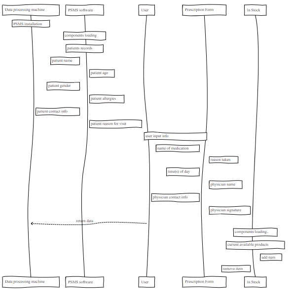

# Pharmacy Store Management Software Group 

Version 0.6

- [1. Introduction](#1-introduction)
- [2. System Overview](#2-system-overview)
- [3. Prerequisites](#3-prerequisites)
- [4. Getting Started](#4-getting-started)
- [5. Access Control and Security](#5-access-control-and-security)
- [6. Design Patterns](#6-design-patterns)
- [7. Testing Setup](#7-testing-setup)
- [8. Revision History](#8-revision-history)

## 1. Introduction

The **Pharmacy Store Management System (PSMS)** main purpose is to accomplish pharmacy tasks operated by Pharmacists and Pharmacy Technicians in a proper standard.
The software will create user-friendly environment to avoid common mistakes such as: Patient information loss and Check in stock products.
The system will have two main sections: The doctor section, and the patient section. Each one will have features that will be available to use.
The medical doctor will be able to fill the patient information in the system with an approved signature. The system will also have “in stock” feature that will allow the user to see current products/items in store. 

## 2. System Overview

The system is designed for independent pharmacies operations. It helps pharmacists and the pharmacy technicians by providing a means to store and access store information. This information will have two different main sections. One section will be for the doctor’s name, contact information, and signature. The other section will be for their customers’ name, age, gender, allergies, contact info, and the reason for visit. There will also be a means of storing information about the pharmacy inventory and brief description of items/products in stock.

## 3. Prerequisites

* Microsoft Windows Environment
  - Any x86 or x64 Intel-compatiable PC supporting Microsoft Windows 8.1 or newer; ARM port is not supported
  - A working Facebook developer account
  - A working JDK SE installation:
  - Oracle JDK8u162 x86 or newer for x86 based OS
  - Oracle JDK8u162 x64 or newer for x64 based OS, JDK 11.0.9(LTS) recommended
  - IDE: IntelliJ IDEA 2017.3.7 or later recommended but not required
* macOS
  - Any x64 Intel-based Apple Macintosh supporting OSX El Capitan (10.11) or later
  - A working Facebook developer account
  - A working JDK installation of Oracle JDK8u162 or newer x64, JDK 11.0.9(LTS) recommended
  - IDE: IntelliJ IDEA 2017.3.7 or later recommended but not required

## 4. Getting Started

* System Interfaces
PSMS-V01 will be addressing the file system interface with incorporating of the interaction of databases systems and the human inputs. 

* User Interfaces
The user interfaces will be containing both command-driven interface menu-driven interface where the user can use a command or select a command from various options displayed on the screen. 
The user will open the application, it will contain a box for login info, it will display the user’s name, time and date, search button to find an inventory info about specific medication, patient’s profile button, doctor profile button, create new patient profile button. 
 
* Hardware interfaces
PCs or Laptops than run on Windows 10 as minimum or Linux they may or may not have Touch Screen feature.
USB - External Peripherals will be used for the purpose of using keyboards, mice, printers. For network, ethernet will be used to hook up cables or DSL modem. In addition, wireless network can be used such as Wi-Fi. 

* Software interfaces: Data Stream, menu driven (mdi), and graphical user interface (GUI JAVA)
* Communication Interfaces: On board and external communication interfaces.
* Memory Constraints: Windows 10 Education – 2TB
* Operations will include software Operations & Maintenance such as:
  - operating production software applications
  - monitoring system performance
  - making defect repairs
  - testing the application after any changes are made
  - tuning a releases software system.
  - Backup data recovery

* Site Adaptation Requirements

The software will be installed on the PCs of the pharmacy store. The software will be easy to install by the pharmacy technician and easy to maintain. 

* Product functions

Pharmacy store management system functions are to store and access store information. This information will be stored in tow different sections. One section will be for the doctor’s name, contact information, and signature. The other section will be for their customers’ name, age, gender, allergies, contact info, and the reason for visit. Also, it will contain search feature in which to provide information about the pharmacy inventory and brief description of items/products in stock. 

* User characteristics

The typical user will be the pharmacists and the pharmacy technicians who have knowledge how to use a computer besides their job description. 

* Constraints, assumptions, and dependencies

PSMS will be available on the operating systems specified if it is not available, then the SRS will change accordingly. In addition, any changes in the requirements their will be changing accordingly.  

## 5. Access Control and Security

| *Attribute*  | *Authorized User* |
| -------------| -------------     |
| Installation | Developer         |
| Main Control | Authorized User   |
| Records      | Authorized User   |
| Prescription | Authorized User   |
| In stock     | Authorized User   |

## 6. Design Patterns

  

## 7. Testing Setup

* Maven is used to run unit tests.

## 8. Revision History
| Date  | Version  | Description  | Author  |
| ------------ | ------------ | ------------ | ------------ |
| 2/7/2021  | 0.1  | Initial push  | Mustafa  |
| 2/7/2021  | 0.1  | Features added   | Huda  |
